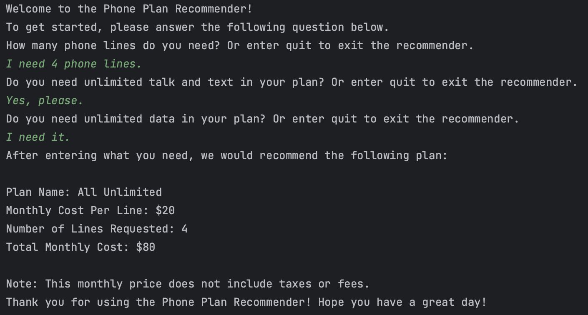
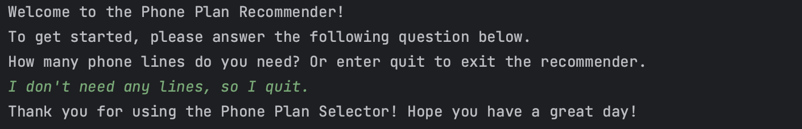
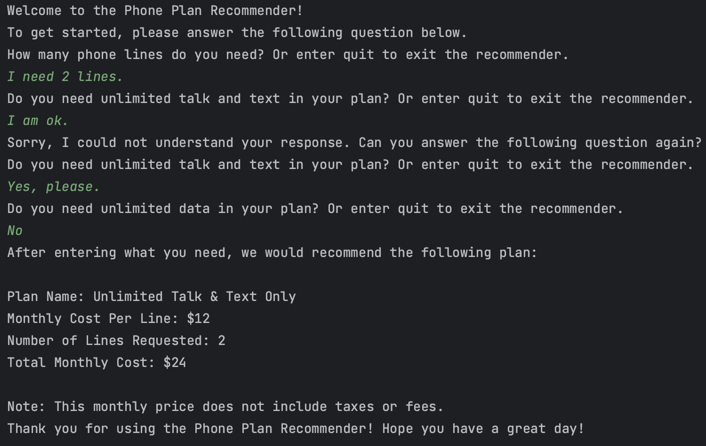

# Phone Plan Recommender Chatbot by Aung Paing Soe

## Setup/Installation Instructions

- Clone this repository by entering the following in command line:\
```git clone https://github.com/aungpaingsoe3/recommender_chatbot.git```
  - The repository contains the following files:
    - ```chatbot.py``` includes the implementation of the chatbot.
    - ```phone_plans.py``` includes a dictionary of sample phone plans used in the chatbot.
- Move to the directory that has the cloned ```recommender_chatbot```repository by entering the following command:\
```cd <path-to/recommender_chatbot>```
- Run the chatbot by entering the following command:\
```python chatbot.py```

## Explanation of Approach

- Designed a simple command-line rule-based chatbot conversation flow of assisting users to choose the best phone plan
- Asked questions on the number of phone lines, the desire for unlimited talk, text, and data
- Utilized regular expressions (Regex) to search for keywords that indicate user input
- Recommends the best phone plans based on user input along with total monthly cost
- <u>Error Handling Scenarios</u>:
  - When user enters unclear or unrelated answers at any point in the interaction, the chatbot prints out the message:
    ```I am sorry I could not understand your request.```, and requests the user to enter the response again.
  - When the user wants to stop using the chatbot at any point, the user enters ```quit``` and the chatbot will be
    terminated.

## Screenshot of Chatbot in Action
### Complete Interaction


### Exiting the Chatbot


### Asking the Question again for Clarity



